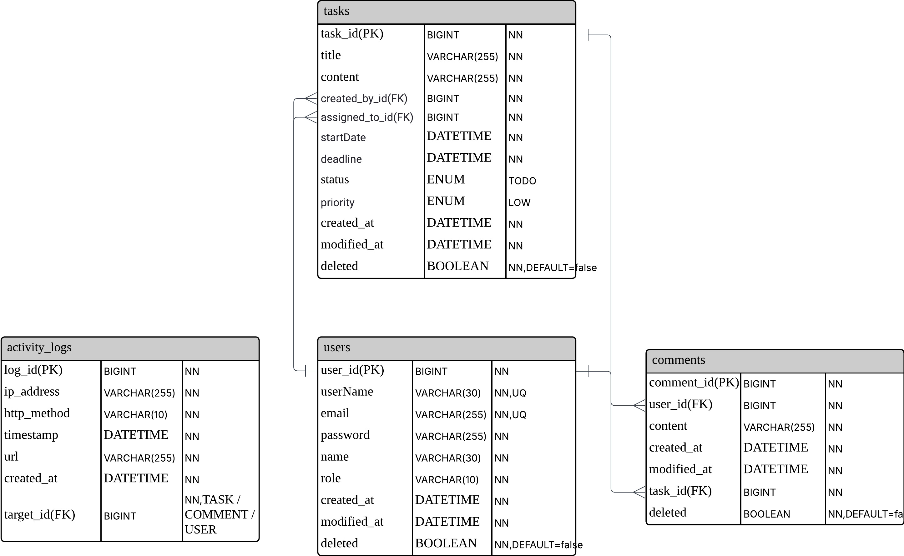

# TaskFlow

---
## 프로젝트 개요
TaskFlow는 팀원 간의 할일(Task)을 효율적으로 관리할 수 있도록 돕는 업무 태스크 관리 시스템입니다.
사용자는 할일을 생성하고 담당자를 지정하여 상태(예: TODO, 진행 중, 완료)를 변경하면서 작업을 체계적으로 추적할 수 있습니다.

또한 댓글 기능을 통한 커뮤니케이션과 더불어 대시보드에서 진행률과 통계 정보를 시각적으로 확인할 수 있어 작업 흐름을 한눈에 파악할 수 있습니다.

---
### 주요 목적
- 팀 프로젝트에서 할일을 효율적으로 배정하고 관리하기 위한 백엔드 시스템 구축
- Restful API 설계 및 JWT 기반 인증 구조 학습
- AOP, JPA, QueryDSL 등을 실무에서 자주 사용되는 기능 학습
- 실시간 데이터 통계를 위한 대시보드 API 구성 연습

---
### 특징
- Spring Security, JWT 인증을 통한 보안 처리
- Spring Event 기반 비동기 이벤트 처리
- QueryDSL + JPA를 활용한 유연한 동적 쿼리
- AOP를 활용한 활동 로그 자동 기록

---
##  기술스택
### Backend
- Java 17
- Spring Boot 3.5
- Spring Data JPA
- Spring Security
- Spring Event

### Database
- MySQL

### 기타
- IntelliJ IDEA
- JWT
- QueryDSL

---
## API 명세

API 개요

### Task(일정)

| 도메인 | 기능 | URL | 메서드 | 요청 데이터 | 응답 |
|--------|------|-----|--------|--------------|------|
| Task | 할일 상태값 수정 | /api/tasks/{task_Id} | PATCH | `{ "status": "in_progress" }` | 공통응답 (변동상태 반영, 상태가 `Done → In_progress`일 경우 `startDate` 포함) |
| Task | 할일 작성 | /api/tasks | POST | `{ "assignedToId":1, "title":"제목", "content":"내용", "deadline":"20250616", "priority":"Low" }` | 생성된 Task 데이터 포함 공통 응답 |
| Task | 할일 삭제 | /api/tasks/{task_Id} | DELETE | 없음 | 공통응답 (데이터 없음) |
| Task | 할일 목록 조회 | /api/tasks | GET | `periodStart`, `periodEnd`, `page`, `size` | 페이징 공통응답 |
| Task | 할일 단건 조회 | /api/tasks/{task_Id} | GET | 없음 | 공통응답 (댓글 포함) |
| Task | 할일 전체 수정 | /api/tasks/{task_Id} | PUT | `{ "assignedToId":1, "title":"제목", "content":"내용", "deadline":"20250616", "priority":"low" }` | 수정 데이터 반영 공통응답 |

---
### 대시보드

| 도메인 | 기능 | URL | 메서드 | 요청 데이터 | 응답 |
|--------|------|-----|--------|--------------|------|
| Dashboard | 상태별 태스크 조회 | /api/dashboards/tasks | GET | `status=todo` 또는 `in_progress` | 공통응답 |
| Dashboard | 완료율 조회 | /api/dashboards/status-summary | GET | 없음 | 공통응답 |
| Dashboard | 상태별 태스크 수 | /api/dashboards/status-count | GET | 없음 | 공통응답 (한 번에 3개 조회) |
| Dashboard | 내 태스크 요약 | /api/dashboards/summary | GET | 없음 | 공통응답 |
| Dashboard | 전체 태스크 통계 | /api/dashboards | GET | 없음 | 공통응답 |

---
### User

| 도메인 | 기능 | URL | 메서드 | 요청 데이터 | 응답 |
|--------|------|-----|--------|--------------|------|
| User | 회원가입 | /api/signup | POST | `{ "email": "...", "password": "...", "username": "...", "name": "..." }` | 공통응답 |
| User | 로그인 | /api/login | GET | `{ "username": "...", "password": "..." }` | 공통응답 |
| User | 로그아웃 | /api/logout | POST | `{ "token": "..." }` | 공통응답 |
| User | 회원탈퇴 | /api/users | DELETE | 없음 | 공통응답 |

---
### Comment

| 도메인 | 기능 | URL | 메서드 | 요청 데이터 | 응답 |
|--------|------|-----|--------|--------------|------|
| Comment | 댓글 전체 조회 | /api/tasks/comments | GET | 없음 | 공통응답 |
| Comment | 댓글 작성 | /api/tasks/comments | POST | `{ "taskId": 1, "content": "댓글 내용" }` | 작성된 댓글 데이터 포함 응답 |
| Comment | 댓글 수정 | /api/tasks/comments/{comment_Id} | PATCH | `{ "content": "수정한 댓글 내용" }` | 수정된 댓글 데이터 포함 응답 |
| Comment | 댓글 단건 조회 | /api/tasks/comments/{comment_Id} | GET | 없음 | 공통응답 |
| Comment | 댓글 삭제 | /api/tasks/comments/{comment_Id} | DELETE | 없음 | 공통응답 |

---
### Log

| 도메인 | 기능 | URL | 메서드 | 요청 데이터 | 응답 |
|--------|------|-----|--------|--------------|------|
| Log | 로그 조회 | /activities | GET | 없음 | 공통응답 |

---
## ERD

ERD

### Entity 구성
- User: 회원 정보 (작성자/담당자 모두 사용자 테이블 참조)
- Task: 할일 정보, assignedToId, createdById 외래키 포함
- Comment: Task에 달리는 댓글 / 1:N 구조
- Log(Activity): AOP 기반으로 기록되는 활동 로그
- TokenBlacklist: 로그아웃 시 처리된 토큰 저장소

---
## 주요 기능

### 1. 회원 인증 및 관리
- 회원은 이메일, 비밀번호, 이름, 사용자명을 입력해 가입할 수 있으며 로그인 시 JWT 기반 인증을 수행합니다.
- 로그인 후 발급된 토큰을 통해 인증된 사용자만 할일 작성/수정/삭제가 가능하며 로그아웃 및 탈퇴 기능도 지원합니다.
- 로그아웃, 탈퇴 시 발급된 토큰은 블랙리스트로 관리되며 해당 블랙리스트 토큰은 매 시 정각을 기준으로 자동삭제됩니다.

### 2. Task(할일) 관리
- 할일(Task)은 담당자 ID, 제목, 내용, 마감일, 우선순위를 설정하여 생성할 수 있으며 작성자는 자동으로 현재 로그인한 사용자로 설정됩니다.
- 할일 상태는 `TODO`, `IN_PROGRESS`, `DONE` 으로 관리되며 상태 변경 시 `startDate`, `completeDate` 등을 자동으로 업데이트합니다.
- 할일 삭제 시 논리 삭제를 구현하여 데이터 복구를 용이하게 할 수 있도록 설계했습니다.
- 삭제 이벤트를 발행하여 댓글을 할일과 함께 관리할 수 있습니다. 
- 시작일과 종료일을 기준으로 할일을 조회할 수 있으며 QueryDSL을 통해 제목/내용/상태 기준으로 동적 검색이 가능합니다.
- 페이징 처리로 대량 데이터에 대한 성능 저하를 방지하며 프론트엔드에서 쉽게 연동할 수 있도록 `page`, `size` 파라미터를 지원합니다.

### 3. 대시보드 통계
- 전체 할일 중 상태별 개수(TODO, IN_PROGRESS, DONE)를 한번에 조회할 수 있으며 사용자별 할일 통계도 함께 제공합니다.
- 완료율(%)도 함께 계산되어 할일 관리의 진행 상황을 직관적으로 확인할 수 있습니다.
- 내부적으로 JPQL을 사용해 동적으로 쿼리를 생성하며 성능 최적화를 위한 Fetch Join 및 DTO 매핑(프로젝션)을 활용합니다.

### 4. 댓글 기능
- 각 할일(Task)에는 댓글을 달 수 있으며 댓글은 작성/조회/수정/삭제 기능을 지원합니다.
- 댓글은 할일과 1:N 관계를 가지며 작성자 정보 및 작성/수정 시간도 함께 관리됩니다.

### 5. 활동 로그 기록
- 사용자의 주요 활동(할일 생성, 수정, 상태변경 등)은 AOP를 통해 자동으로 로그가 저장됩니다.
- 활동 로그는 `/activities` API를 통해 전체 조회할 수 있으며 운영자가 시스템 흐름을 추적하는 데 유용합니다.